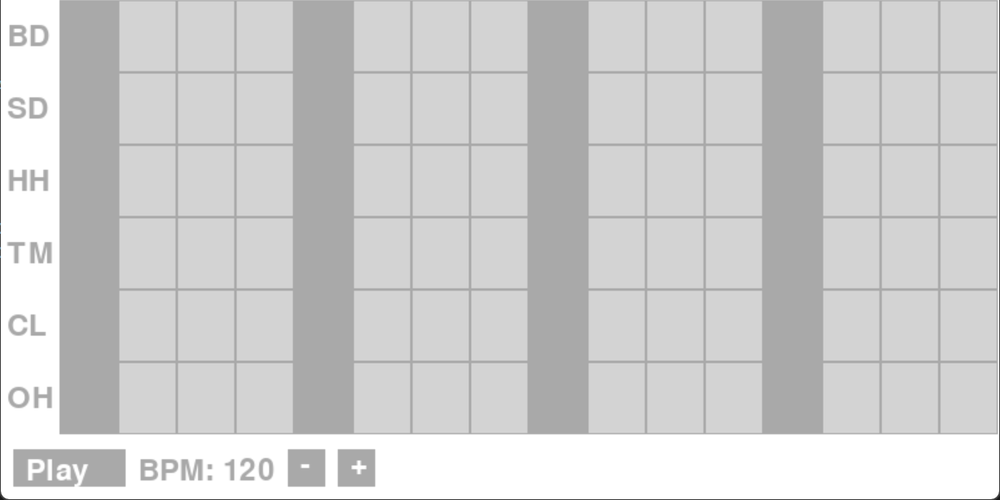

# Pygame Drum Machine
PythonとPygameで作成した、ドラムシーケンサー・リズムマシンを再現したアプリケーションです。ドラムパートを作成し、再生することができます。TR-808のドラム音源(フリー音源)を使用しています。マウス、キーボードのどちらでも操作が可能です。BPMの表示・調整も可能です。ただし、Pygameの処理の関係でBPMは正確ではありません。

## 操作説明
左にドラムの音の種類が記載されています。
 BD - Bass Drum
 SD - Snare Drum
 HH - HiHat
 TM - Tom
 CL - Clap
 OH - Open-HiHat
 各ドラム音の行にノーツの配置が表示されています。
下に再生・停止ボタン、BPM表示、BPM調整ボタンがあります。
再生すると、青いハイライトが表示され、速さを確認できます。
### マウス
クリックで操作可能です。マスのところにクリックすると、ノーツを配置することができます。下のボタンで再生、停止、BPM変更が可能です。
### キーボード
1-6キー - 各ドラム音を再生する。再生したまま押すことで、リアルタイム演奏が可能です。
 スペースキー - 再生・停止する。
 Rキー - 全てのノーツを消去する。
 ↑↓キー - BPMを変更する。
 ←→キー - 拍子の数を変更する。